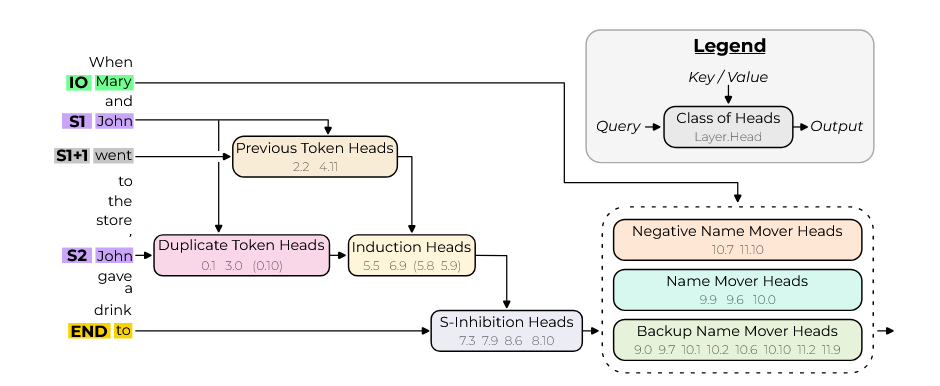

# Mechanistic Interpretability of Grammatical Structures

This project implements path patching experiments for analyzing the Indirect Object Identification (IOI) task using GPT-2 small, based on the mechanistic interpretability framework.

## IOI Task Overview
### IOI Sentences
A sentence containing IOI begins with an initial dependent clause (e.g., "When Mary and John went to the store,") and ends with a main clause (e.g., "John gave a drink to Mary"). The sentence will introduce a subject (S) and an indirect object (IO) in the dependent clause. In the main clause, the subject will preform an action onto the indirect object (e.g., "John gave a drink to Mary" has John as S and Mary as IO). 

### LLM Prediction Task
Now given an IOI sentence, we remove the finally word(this is the indirect object, e.g., "When Mary and John went to the store, John gave a drink to") and ask the language model to predict the next token. The model should predict the indirect object rather than the repeated subject (e.g., "John gave a drink to Mary" not "John gave a drink to John"). We will refer to the first occurance of the subject as S1 (in the dependent clause) and the second occurance of the subject as S2 (in the main clause). Thus an example IOI sentence is:

- "When IO and S1 went to the store, S2 gave a drink to" 
- model should predict IO rather than S.

The goal of this project is to understand how a small LLM is able to solve this task using mechanistic interpretability methods.

### Transformer Architecture
We will use GPT-2 small, a decoder-only transformer with 12 layers and 12 attention heads per attention layer.

### Propused Circuit for IOI
The authors of "Interpretability in the Wild" propose a circuit for how GPT-2 small solves the IOI task (quotes and images taken from this paper for this subsection). To understand, let's take the example "When Mary and John went to the store, John gave a drink to". A human-interpretable algorithm for solving IOI:

1. Identify all previous names in the sentence (Mary, John, John)
2. Remove the duplicate names (John)
3. Output the last remaining name (Mary) 

The paper proposes that GPT-2 small implements a similar algorithm using attention heads. The primary class of heads are:
- "**Duplicate Token Heads**, identify tokens that have already appeared in the sentence. They are active at the S2 token, attend primarily to the S1 token, and signal that token duplication has occurred by writing the position of the duplicate token."
- "**S-Inhibition Heads** remove duplicate tokens from Name Mover Heads’ attention. They are active at the END token, attend to the S2 token, and write in the query of the Name Mover Heads, inhibiting their attention to S1 and S2 tokens."
- "**Name Mover Heads** output the remaining name. They are active at END, attend to previous names in the sentence, and copy the names they attend to. Due to the S-Inhibition Heads, they attend to the IO token over the S1 and S2 tokens."



## Data Set Generation
We generated a data set $\text{p}_\text{IoI}$ of IOI sentences using the scripts in the `data_generation_simple/` folder. Similarly, we will use $\text{p}_\text{IoI-corrupt}$, a corrupted version of the data set where all names are replaced with random names. More information about the data set can be found .


## Mechanistic Interpretability via Path Patching
We will implement path patching experiments to verify the proposed circuit. 

### Path Patching Overview
We will begin at the logits and work backwards step-by-step. At each step, we identify components that directly influence the current component of interest using path patching. 

Path patching replaces parot of a model's forward pass with activations from a different input. That is, given inputs $x_\text{origin}$ and $x_\text{new}$, and a set of paths $\mathcal{P}$ emanating from an attentation head $h$, path patching runs a forward pass on $x_\text{origin}$ but uses the pathes $\mathcal{P}$ from $x_\text{new}$. This allows us to isolate the effect of specific paths on the model's output.

We will always have $x_\text{origin}$ be sampled from the IOI data set $\text{p}_\text{IoI}$, and $x_\text{new}$ to be the corresponding sample from the corrupted data set $\text{p}_\text{IoI-corrupt}$. We now run this on many different samples from $\text{p}_\text{IoI}$ and measure the average logit difference. **Critical; pathways can be identified by those with induce a significant effect on the logit difference when removed.** This is implemented as

```python 
clean_prompt = f"When{io_name} and{s_name} went to the store,{s_name} gave a drink to"
corrupt_prompt = f"When{random_name1} and{random_name2} went to the store,{random_name3} gave a drink to"
```

### Path Patching Algorithm
The inputs are

- $x_\text{origin}$ the original data point
- $x_\text{new}$ the new data point
- $h$ the *sender* attention head, and
- $R \subseteq M$ the set of *reciever* nodes in the model's computational graph $M$. In this case, $R$ is either the input (key, query, or values) of a set of attention heads or the end state of the residual stream.

The algorthim can be summarized in five steps

1. Gather activations on $x_\text{origin}$ and $x_\text{new}$  
2. Freeze all the heads to their activations on $x_\text{origin}$ except $h$ that is patched to its activation on $x_\text{new}$.
3. Run a forward pass of the model on $x_\text{origin}$ with the frozen and patched nodes (MLPs (feed-forward network) and layer norm are recomputed)
4. In this forwad pass, save the activation of the model components $r \in R$ as if they were recomputed.
5. Run a last forwad pass on $x_\text{origin}$ patching the reciever nodes in $R$ to the saved values.


## Setup

### Environment Setup (Windows)

1. **Create and activate virtual environment:**
   ```powershell
   # One-time setup (or to recreate environment)
   powershell -ExecutionPolicy Bypass -File .\setup_ioi_env.ps1 -EnvName "ioi-env"
   ```

2. **Activate environment for future sessions:**
   ```powershell
   . .\ioi-env\Scripts\Activate.ps1
   ```

The setup script will install all required dependencies including:
- `torch` - PyTorch for neural network operations
- `transformer-lens` - TransformerLens for model analysis
- `transformers` - Hugging Face transformers
- `einops` - Tensor operations
- `matplotlib` - Plotting and visualization

If torch isn't finding your cuda device, try overriding the torch download with:
```powershell
pip3 install torch torchvision torchaudio --index-url https://download.pytorch.org/whl/cu124
```

## Basic Usage

### Running a Simple Experiment

The simplest way to run an IOI path patching experiment:

```powershell
. .\ioi-env\Scripts\Activate.ps1
py .\path_patching\example.py
```

This will:
- Load GPT-2 small model (auto-detects GPU/CPU)
- Generate 2000 IOI examples
- Evaluate model performance
- Create attention heatmaps
- Run residual path patching analysis
- Save all plots to the current directory

Please reference `path_pathing\example.py` and `path_pathing\gpu_cpu_comp.py` for example usage.

### Custom Configuration

Create a custom experiment with specific settings:

```python
from IOI_pathpatching_gpu import IOIConfig, run_ioi

# Configure experiment
cfg = IOIConfig(
    device="cuda",              # Force GPU (or "cpu", "mps", None for auto)
    n_examples=1000,            # Number of dataset examples
    n_heatmap_examples=100,     # Subset for attention analysis
    model_name="gpt2-small",    # Model to analyze
    seed=42,                    # Random seed for reproducibility
    output_dir="results/exp1",  # Directory to save plots
)

# Run experiment
run_ioi(cfg)
```

### Output Files

Each experiment generates the following visualizations:

- `attn_end_to_io.png` - Attention from END token to IO (indirect object) position
- `attn_end_to_s2.png` - Attention from END token to S2 (repeated subject) position
- `attn_end_io_minus_s2.png` - Difference heatmap showing IO preference
- `resid_patching_heatmap.png` - Residual stream path patching effects


### Using Pre-Generated IOI Pairs

For more controlled experiments, you can generate clean/corrupt pairs in advance:

```powershell
# Generate datasets
py .\data_generation_simple\generate_ioi_pairs.py
```

This creates pairs where:
- **Clean**: Standard IOI with correct names: `"When Mary and John went to store, John gave book to [Mary]"`
- **Corrupt**: Random names (not IO/S): `"When Linda and James went to store, James gave book to"`

The corrupt version uses completely different names to test what happens when the model doesn't have the correct name information. See `data_generation_simple/README.md` for details.

## Project Structure

```
├── path_patching/
│   ├── IOI_pathpatching_gpu.py    # Main experiment implementation
│   ├── utils.py                    # Dataset and evaluation utilities
│   ├── plotting.py                 # Visualization functions
│   ├── example.py                  # Basic usage example
│   ├── gpu_cpu_comp.py            # GPU vs CPU benchmark
│   └── example_with_output_dir.py # Custom output directory demo
├── data_generation/
│   ├── generate_dataset.py         # Complex dataset generation
│   └── input/                      # Templates and word lists
├── data_generation_simple/
│   ├── generate_ioi_pairs.py      # Simple IOI pair generation
│   ├── load_pairs.py              # Utilities to load pairs
│   ├── example_path_patching.py   # Example using generated pairs
│   └── output/                    # Generated datasets
├── requirements.txt                # Python dependencies
├── setup_ioi_env.ps1              # Environment setup script
└── .gitignore                     # Git ignore rules (includes ioi-env/)
```


## To Do
- [x] Native speaker needs to read through translated [templates](data_generation/input/templates.json)
- [x] Native speaker needs to read through translated [words](data_generation/input/words.json)
- [ ] Understand what is going on
- [ ] Implement unmasked IOI on English dataset
- [ ] Implement unmasked IOI on Chinese dataset
- [ ] Implement masked IOI on English dataset
- [ ] Implement masked IOI on Chinese dataset
- [ ] Implement masked versus unmasked correlation code