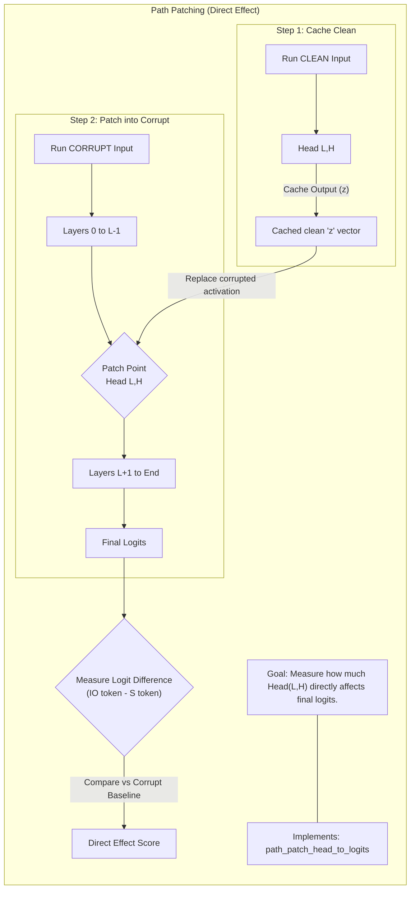
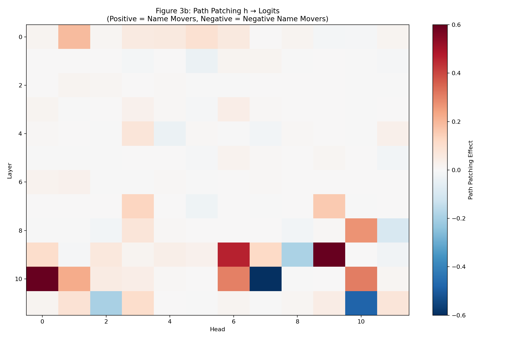
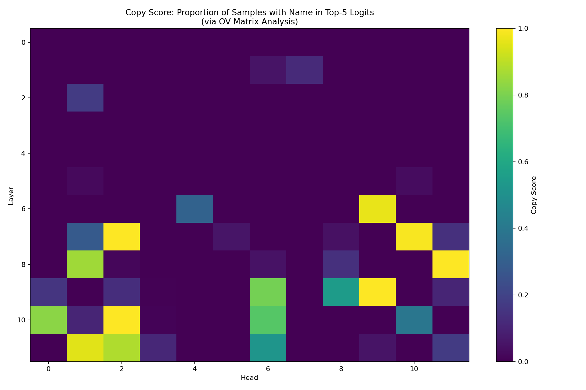
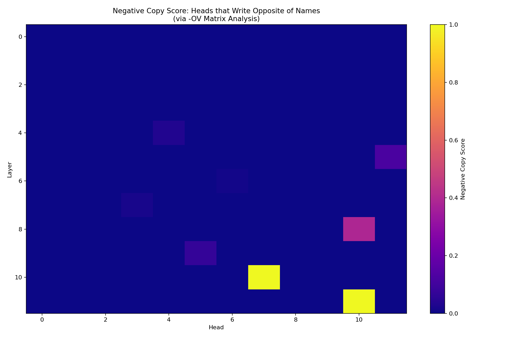

# Mechanistic Interpretability of Grammatical Structures

This project implements path patching experiments for analyzing the Indirect Object Identification (IOI) task using GPT-2 small, based on the mechanistic interpretability framework.

## IOI Task Overview
### IOI Sentences
A sentence containing IOI begins with an initial dependent clause (e.g., "When Mary and John went to the store,") and ends with a main clause (e.g., "John gave a drink to Mary"). The sentence will introduce a subject (S) and an indirect object (IO) in the dependent clause. In the main clause, the subject will preform an action onto the indirect object (e.g., "John gave a drink to Mary" has John as S and Mary as IO). 

### LLM Prediction Task
Now given an IOI sentence, we remove the finally word(this is the indirect object, e.g., "When Mary and John went to the store, John gave a drink to") and ask the language model to predict the next token. The model should predict the indirect object rather than the repeated subject (e.g., "John gave a drink to Mary" not "John gave a drink to John"). We will refer to the first occurance of the subject as S1 (in the dependent clause) and the second occurance of the subject as S2 (in the main clause). Thus an example IOI sentence is:

- "When IO and S1 went to the store, S2 gave a drink to" 
- model should predict IO rather than S.

The goal of this project is to understand how a small LLM is able to solve this task using mechanistic interpretability methods.

### Transformer Architecture
We will use GPT-2 small, a decoder-only transformer with 12 layers and 12 attention heads per attention layer.

### Propused Circuit for IOI
The authors of "Interpretability in the Wild" propose a circuit for how GPT-2 small solves the IOI task (quotes and images taken from this paper for this subsection). To understand, let's take the example "When Mary and John went to the store, John gave a drink to". A human-interpretable algorithm for solving IOI:

1. Identify all previous names in the sentence (Mary, John, John)
2. Remove the duplicate names (John)
3. Output the last remaining name (Mary) 

The paper proposes that GPT-2 small implements a similar algorithm using attention heads. The primary class of heads are:
- "**Duplicate Token Heads**, identify tokens that have already appeared in the sentence. They are active at the S2 token, attend primarily to the S1 token, and signal that token duplication has occurred by writing the position of the duplicate token."
- "**S-Inhibition Heads** remove duplicate tokens from Name Mover Heads’ attention. They are active at the END token, attend to the S2 token, and write in the query of the Name Mover Heads, inhibiting their attention to S1 and S2 tokens."
- "**Name Mover Heads** output the remaining name. They are active at END, attend to previous names in the sentence, and copy the names they attend to. Due to the S-Inhibition Heads, they attend to the IO token over the S1 and S2 tokens."


## Data Set Generation
We generated a data set $\text{p}_\text{IoI}$ of IOI sentences using the scripts in the `data_generation_simple/` folder. Similarly, we will use $\text{p}_\text{IoI-corrupt}$, a corrupted version of the data set where all names are replaced with random names. More information about the data set can be found [here](data_generation_simple/README.md).


## Mechanistic Interpretability via Path Patching
We will implement path patching experiments to verify the proposed circuit. 

### Path Patching Overview
We will begin at the logits and work backwards step-by-step. At each step, we identify components that directly influence the current component of interest using path patching. 

Path patching replaces parot of a model's forward pass with activations from a different input. That is, given inputs $x_\text{origin}$ and $x_\text{new}$, and a set of paths $\mathcal{P}$ emanating from an attentation head $h$, path patching runs a forward pass on $x_\text{origin}$ but uses the pathes $\mathcal{P}$ from $x_\text{new}$. This allows us to isolate the effect of specific paths on the model's output.

We will always have $x_\text{origin}$ be sampled from the IOI data set $\text{p}_\text{IoI}$, and $x_\text{new}$ to be the corresponding sample from the corrupted data set $\text{p}_\text{IoI-corrupt}$. We now run this on many different samples from $\text{p}_\text{IoI}$ and measure the average logit difference. **Critical; pathways can be identified by those with induce a significant effect on the logit difference when removed.** This is implemented as

```python 
clean_prompt = f"When{io_name} and{s_name} went to the store,{s_name} gave a drink to"
corrupt_prompt = f"When{random_name1} and{random_name2} went to the store,{random_name3} gave a drink to"
```

### Path Patching Algorithm
The inputs are

- $x_\text{origin}$ the original data point
- $x_\text{new}$ the new data point
- $h$ the *sender* attention head, and
- $R \subseteq M$ the set of *reciever* nodes in the model's computational graph $M$. In this case, $R$ is either the input (key, query, or values) of a set of attention heads or the end state of the residual stream.

The algorthim can be summarized in five steps

1. Gather activations on $x_\text{origin}$ and $x_\text{new}$  
2. Freeze all the heads to their activations on $x_\text{origin}$ except $h$ that is patched to its activation on $x_\text{new}$.
3. Run a forward pass of the model on $x_\text{origin}$ with the frozen and patched nodes (MLPs (feed-forward network) and layer norm are recomputed)
4. In this forwad pass, save the activation of the model components $r \in R$ as if they were recomputed.
5. Run a last forwad pass on $x_\text{origin}$ patching the reciever nodes in $R$ to the saved values.

### Finding Significant Heads
To find the attention heads that play a significant role in the IOI task, we will patch each head $h$ in the model one at a time, and measure the logit difference change when patching the head. The logit difference is defined as the difference between the logit of the correct indirect object token and the logit of the repeated subject token. Rather than using the full path patching algorithm described aboved, we can use a simplification since we are only patching one head at a time. The simplified algorithm is as follows:

1. Run CLEAN forward pass → cache head h's output
2. Run CORRUPT forward pass → get corrupt logit_diff baseline
3. Run CORRUPT forward pass BUT replace head h with cached clean output
4. Measure: patched_logit_diff - corrupt_logit_diff

In short, we run the clean model and cache the output of head $h$ and all of its downstream computations. We then run the corrupt model, but replace head $h$'s output with the cached clean output. The difference in logit difference between the patched corrupt model and the original corrupt model tells us how much head $h$ contributes to the IOI task. For example, a useless head in the IOI task will have little to no effect when patching the corrupted model. Conversely, an important head will significantly increase the logit difference when patched with the clean output. 


The discussion on the [implementation](path_patching_full/direct_effect_analysis.py) can be found in [name movers notes](path_patching_full/name_movers.md).




The results are summarized in the following figure:




Heads with significant positive effects are seen in red. These are the heads, that when the corrupt model uses the clean output, significantly increase the logit difference towards the correct indirect object token. These heads are likely important for solving the IOI task. These are the heads that correspond to the proposed Name Mover heads in the "Interpretability in the Wild" paper. The heads are 

Interestingly, there are also heads with significant negative effects (blue). These heads, when patched with the clean output, actually decrease the logit difference towards the correct indirect object token. These are the heads that correspond to the proposed Negative Name Mover heads in the "Interpretability in the Wild" paper.

| Category | Head | Effect | Paper Reference |
|----------|------|--------|-----------------|
| **Name Mover Heads** (Positive) | L9H9 | +1.8130 | ✓ (9.9) |
| | L10H0 | +0.7089 | ✓ (10.0) |
| | L9H6 | +0.4613 | ✓ (9.6) |
| | L10H10 | +0.3083 | |
| | L10H6 | +0.3031 | |
| **Negative Name Mover Heads** | L10H7 | -0.7048 | ✓ (10.7) |
| | L11H10 | -0.4803 | ✓ (11.10) |
| | L11H2 | -0.1958 | |
| | L9H8 | -0.1876 | |
| | L8H11 | -0.0953 | |

The table shows the top heads identified through path patching. Name Mover heads (positive effects) help the model predict the correct indirect object, while Negative Name Mover heads (negative effects) work against this prediction. Heads marked with ✓ match those identified in the "Interpretability in the Wild" paper.

#### Name Mover Heads Role Verification
To determine what the Name Mover heads are attending to, we extract the state of the residual stream at the position of eahc name token after the first layer. We then directly multiply this by the OV matrix of a Name Mover Head (as if the head attended perfectly to that token), multiply by the unembedding matrix and get the logit probabilities. We now compute the proportion of samples that contrain the inupt name token in the top 5 logits and call this the copy score.

| Rank | Head | Copy Score | Direct Effect | Notes |
|------|------|------------|---------------|-------|
| 1 | L8H11 | 100.0% | -0.0838 | High copy, negative effect |
| 2 | L9H9 | 100.0% | +1.8055 | **Strong Name Mover** |
| 3 | L7H2 | 100.0% | +0.0005 | High copy, minimal effect |
| 4 | L10H2 | 100.0% | +0.0243 | High copy, small effect |
| 5 | L7H10 | 99.0% | -0.0026 | High copy, minimal effect |
| 6 | L6H9 | 96.7% | +0.0008 | High copy, minimal effect |
| 7 | L11H1 | 95.5% | +0.1105 | High copy, small positive effect |
| 8 | L11H2 | 88.1% | -0.1908 | Negative Name Mover candidate |
| 9 | L8H1 | 85.7% | -0.0015 | High copy, minimal effect |
| 10 | L10H0 | 82.5% | +0.6170 | **Name Mover Head** |


or as summarized in the following heatmap:



While we do have a mean copy score of under 20 percent, we find our Name Mover Heads to have lower copy scores than found in the paper. But we still do observe a strong correlation between high copy scores and positive direct effects, confirming that these heads are indeed copying the indirect object token.

### Negative Name Mover Heads Role Verification
We perform a similar analysis for the Negative Name Mover heads, computing negative copy scores by measuring how often the head outputs the repeated subject token (S2) in its top 5 logits. 

| Rank | Head | Negative Copy Score | Direct Effect | Notes |
|------|------|---------------------|---------------|-------|
| 1 | L10H7 | 100.0% | -0.7467 | **Strong Negative Name Mover** |
| 2 | L11H10 | 100.0% | -0.4481 | **Strong Negative Name Mover** |
| 3 | L8H10 | 38.7% | +0.2753 | High negative copy, positive effect |
| 4 | L5H11 | 12.2% | -0.0157 | Moderate negative copy, minimal effect |
| 5 | L9H5 | 7.0% | +0.0174 | Low negative copy, minimal effect |
| 6 | L4H4 | 3.3% | -0.0333 | Low negative copy, small negative effect |
| 7 | L7H3 | 1.9% | +0.1356 | Low negative copy, small positive effect |
| 8 | L6H6 | 1.1% | -0.0046 | Low negative copy, minimal effect |
| 9 | L9H4 | 0.0% | +0.0379 | No negative copying |
| 10 | L0H7 | 0.0% | +0.0017 | No negative copying |




Here we see a strong correlation between high negative copy scores and negative direct effects, confirming that these heads are indeed copying the repeated subject token.

## What Affects the Name Mover Heads' Attention?
### Tracing back the flow
There are three ways to influence an attention head: through its query, key, or value vectors.  


## Setup

### Environment Setup (Windows)

1. **Create and activate virtual environment:**
   ```powershell
   # One-time setup (or to recreate environment)
   powershell -ExecutionPolicy Bypass -File .\setup_ioi_env.ps1 -EnvName "ioi-env"
   ```

2. **Activate environment for future sessions:**
   ```powershell
   . .\ioi-env\Scripts\Activate.ps1
   ```

The setup script will install all required dependencies including:
- `torch` - PyTorch for neural network operations
- `transformer-lens` - TransformerLens for model analysis
- `transformers` - Hugging Face transformers
- `einops` - Tensor operations
- `matplotlib` - Plotting and visualization

If torch isn't finding your cuda device, try overriding the torch download with:
```powershell
pip3 install torch torchvision torchaudio --index-url https://download.pytorch.org/whl/cu124
```

## Basic Usage

### Running a Simple Experiment

The simplest way to run an IOI path patching experiment:

```powershell
. .\ioi-env\Scripts\Activate.ps1
py .\path_patching\example.py
```

This will:
- Load GPT-2 small model (auto-detects GPU/CPU)
- Generate 2000 IOI examples
- Evaluate model performance
- Create attention heatmaps
- Run residual path patching analysis
- Save all plots to the current directory

Please reference `path_pathing\example.py` and `path_pathing\gpu_cpu_comp.py` for example usage.

### Custom Configuration

Create a custom experiment with specific settings:

```python
from IOI_pathpatching_gpu import IOIConfig, run_ioi

# Configure experiment
cfg = IOIConfig(
    device="cuda",              # Force GPU (or "cpu", "mps", None for auto)
    n_examples=1000,            # Number of dataset examples
    n_heatmap_examples=100,     # Subset for attention analysis
    model_name="gpt2-small",    # Model to analyze
    seed=42,                    # Random seed for reproducibility
    output_dir="results/exp1",  # Directory to save plots
)

# Run experiment
run_ioi(cfg)
```

### Output Files

Each experiment generates the following visualizations:

- `attn_end_to_io.png` - Attention from END token to IO (indirect object) position
- `attn_end_to_s2.png` - Attention from END token to S2 (repeated subject) position
- `attn_end_io_minus_s2.png` - Difference heatmap showing IO preference
- `resid_patching_heatmap.png` - Residual stream path patching effects


### Using Pre-Generated IOI Pairs

For more controlled experiments, you can generate clean/corrupt pairs in advance:

```powershell
# Generate datasets
py .\data_generation_simple\generate_ioi_pairs.py
```

This creates pairs where:
- **Clean**: Standard IOI with correct names: `"When Mary and John went to store, John gave book to [Mary]"`
- **Corrupt**: Random names (not IO/S): `"When Linda and James went to store, James gave book to"`

The corrupt version uses completely different names to test what happens when the model doesn't have the correct name information. See `data_generation_simple/README.md` for details.

## Project Structure

```
├── path_patching/
│   ├── IOI_pathpatching_gpu.py    # Main experiment implementation
│   ├── utils.py                    # Dataset and evaluation utilities
│   ├── plotting.py                 # Visualization functions
│   ├── example.py                  # Basic usage example
│   ├── gpu_cpu_comp.py            # GPU vs CPU benchmark
│   └── example_with_output_dir.py # Custom output directory demo
├── data_generation/
│   ├── generate_dataset.py         # Complex dataset generation
│   └── input/                      # Templates and word lists
├── data_generation_simple/
│   ├── generate_ioi_pairs.py      # Simple IOI pair generation
│   ├── load_pairs.py              # Utilities to load pairs
│   ├── example_path_patching.py   # Example using generated pairs
│   └── output/                    # Generated datasets
├── requirements.txt                # Python dependencies
├── setup_ioi_env.ps1              # Environment setup script
└── .gitignore                     # Git ignore rules (includes ioi-env/)
```


## Color-Object Association Task (Novel Extension)

We are implementing a **new task** to discover circuits in GPT-2 small for compositional reasoning. See [`color_object_association/`](color_object_association/) for details.

**Task**: Given color-object pairs and a preference, predict the preferred object.
```
"The red ball and blue cube are here. I prefer the red, so I'll take the"
→ Model should predict: "ball"
```

**Expected Circuit**:
1. **Association Heads** (L0-L3): Bind color↔object pairs
2. **Preference Detection** (L4-L7): Identify preferred color
3. **Color Retriever Heads** (L8-L10): Look up associated object
4. **Object Mover Heads** (L10-L11): Output object to logits

This extends our IOI work to test if similar mechanistic patterns emerge for different compositional reasoning tasks.

## To Do

### IOI Task (Completed)
- [x] Native speaker needs to read through translated [templates](data_generation/input/templates.json)
- [x] Native speaker needs to read through translated [words](data_generation/input/words.json)
- [x] Understand what is going on
- [x] Implement unmasked IOI on English dataset
- [x] Identify Name Mover Heads via path patching
- [x] Verify Name Mover mechanism with copy scores

### IOI Task (Future)
- [ ] Implement unmasked IOI on Chinese dataset
- [ ] Implement masked IOI on English dataset
- [ ] Implement masked IOI on Chinese dataset
- [ ] Implement masked versus unmasked correlation code

### Color-Object Association Task (New)
- [x] Design task and expected circuit
- [ ] Generate color-object association dataset
- [ ] Implement path patching for direct effects
- [ ] Identify Object Mover Heads
- [ ] Verify copy scores for Object Movers
- [ ] Compare circuit structure with IOI task